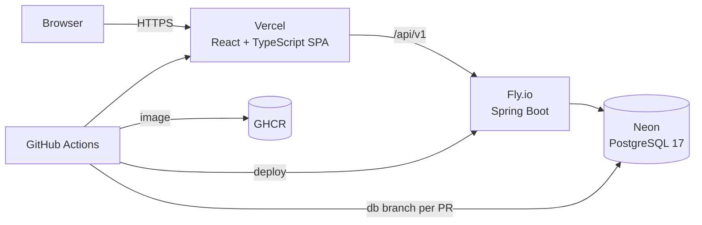

# DoubleEntryLedger

An append-only double-entry accounting ledger. Every financial transaction
touches at least two accounts with equal debits and credits, balances are
derived from the entries rather than stored, and mistakes are corrected by
posting reversals — never by editing history.

Java · Spring Boot · PostgreSQL · React · TypeScript

**Live demo:** _(pending first deploy)_ · **API docs:** `/swagger-ui.html` ·
**Design docs:** [`docs/`](docs/)

> **Status: implemented, not yet deployed.** The ledger, the API, reconciliation
> and the back office all run — `pnpm stack:up` gives you the whole thing
> locally, and CI runs the backend and frontend suites plus a Playwright pass
> against a real Postgres on every push. What is left before the live demo is
> the deployment pipeline itself, and the observability the running service
> needs. [Roadmap §9.1](docs/09-roadmap.md#91-in-scope-for-v1) tracks each v1
> capability against what is actually in the repository.

---

## Why this exists

Most tutorial ledgers store a balance column and update it. That works until the
first duplicate request, the first failed transaction, or the first auditor
asking what the balance was on 30 June. This one is built around the properties
that make a ledger trustworthy, and each of them is enforced by the database and
proven by tests:

| Property | How it is guaranteed |
|---|---|
| **Every entry balances** | A deferred constraint trigger checks `SUM(signed_amount_minor) = 0` at commit. An unbalanced entry cannot become durable by any route — not the API, not a migration, not a `psql` session. |
| **Nothing is ever edited** | `UPDATE` and `DELETE` are revoked from the application's database role and blocked by triggers. Corrections are reversal entries linked to the original. |
| **Balances are derived** | No stored balance exists to drift from the journal. A balance as of any past date is the same query as today's. |
| **Money is exact** | Integer minor units end to end — `BIGINT` in Postgres, `long` in Java, a branded integer type in TypeScript. No float touches an amount. |
| **Retries are safe** | Every write endpoint requires an `Idempotency-Key`. Correctness rests on a primary-key conflict, not on a check-then-insert race. |
| **Differences are explained** | Reconciliation classifies every break by type and asserts that the deltas sum exactly to the ledger-to-statement difference — a property test injects random discrepancies and requires the bridge to close every time. |
| **The auditor cannot write** | Roles are enforced on the service layer, not the controllers, so a new endpoint cannot expose an unguarded path. Refresh tokens rotate, and replaying one revokes the whole session family. |

## What it does

- **Journal** — n-line entries with full provenance: who posted it, when it was
  effective, when it was recorded, which request created it.
- **Accounts** — a chart of accounts with types, hierarchy and per-account
  currency; balances and statement views with running totals, as of any date.
- **Transfers** — a two-line convenience over the journal, idempotent under
  retry.
- **Reversals** — server-generated mirrors of an existing entry, with a
  mandatory reason, at most one per entry.
- **Reconciliation** — import a bank statement, match it against the journal in
  four passes of decreasing certainty, and produce a bridge that accounts for
  every cent of the difference.
- **Back office** — a React operator console covering all of the above, plus the
  audit trail behind each entry.
- **Roles** — `OPERATOR`, `AUDITOR`, `ADMIN`. The auditor can see everything and
  change nothing, enforced at the service layer.

## Architecture



| Layer | Stack |
|---|---|
| Backend | Java 21, Spring Boot 3.5, Flyway, JDBC, Spring Security (JWT RS256) |
| Database | PostgreSQL 17 — deferred constraint triggers, generated columns, `pg_trgm` |
| Frontend | React, TypeScript (`strict`), Vite, TanStack Query, Tailwind |
| Testing | JUnit 5, Testcontainers, jqwik, ArchUnit, Vitest, Playwright |
| CI/CD | GitHub Actions, Docker, GHCR, Fly.io, Neon, Vercel |

Frontend and backend share one repository with path-filtered workflows, so each
deploys independently while a full-stack change stays one commit
([ADR-0009](docs/adr/0009-monorepo.md)).

## Documentation

Start with [`docs/`](docs/README.md).

| | |
|---|---|
| [Domain Model](docs/01-domain-model.md) | Accounts, entries, the nine invariants |
| [Data Model](docs/02-data-model.md) | Schema, constraints, triggers, balance queries |
| [API Design](docs/03-api.md) | Endpoints, money on the wire, errors, roles |
| [Idempotency](docs/04-idempotency.md) | Why a retry cannot post twice |
| [Reconciliation](docs/05-reconciliation.md) | Matching pipeline and the bridge invariant |
| [Back Office](docs/06-frontend.md) | Screens, money in TypeScript, auth handling |
| [Testing](docs/07-testing.md) | Invariants as tests, property-based testing, CI gates |
| [Deployment](docs/08-deployment.md) | Docker, Actions, Fly, Neon, preview environments |
| [Roadmap](docs/09-roadmap.md) | Deferred work and explicit non-goals |
| [ADRs](docs/adr/) | Nine decisions with costs and rejected alternatives |

## An entry, end to end

A card payment of 100.00 EUR with a 2.90 EUR processor fee is **one** entry with
three lines — the fee and the settlement are the same event and must not be able
to exist independently:

```http
POST /api/v1/journal-entries
Idempotency-Key: 7c9e6679-7425-40de-944b-e07fc1f90ae7

{
  "effectiveDate": "2026-06-30",
  "description": "Card payment #4471 settled",
  "currency": "EUR",
  "lines": [
    { "accountCode": "1100", "direction": "DEBIT",  "amountMinor":  9710 },
    { "accountCode": "5000", "direction": "DEBIT",  "amountMinor":   290 },
    { "accountCode": "4000", "direction": "CREDIT", "amountMinor": 10000 }
  ]
}
```

Send it again with the same key and you get `200` with
`Idempotency-Replayed: true` and the same entry id — not a second posting.

## Running locally

**Prerequisites:** JDK **21**, Node 22, pnpm 10, Docker with Compose v2. Maven is
*not* needed — the wrapper (`backend/mvnw`) fetches it. Full setup, including
Apple Silicon notes and troubleshooting: [`docs/00-local-setup.md`](docs/00-local-setup.md).

```bash
git clone https://github.com/LorenzoSegaliniAtex/DoubleEntryLedger.git
cd DoubleEntryLedger
cp infra/.env.example infra/.env
pnpm install

pnpm stack:up          # Postgres + backend + frontend in Docker, waits for health
pnpm stack:down        # stop
```

| | |
|---|---|
| Back office | http://localhost:5173 |
| API | http://localhost:8080/api/v1 |
| Swagger UI | http://localhost:8080/swagger-ui.html |

Or database only, with the apps from your IDE — the faster inner loop:

```bash
pnpm stack:db            # PostgreSQL on :5432
pnpm backend:run   # Spring Boot on :8080
pnpm dev           # Vite on :5173
```

Tests:

```bash
pnpm backend:test                  # ./mvnw verify — unit, property, Testcontainers, ArchUnit
pnpm test                          # Vitest
pnpm --filter frontend test:e2e    # Playwright against the Compose stack
```

Testcontainers needs a running Docker daemon. There is no H2 fallback —
[half the invariants live in PostgreSQL-specific features](docs/07-testing.md#71-layers),
so a test that did not run against real Postgres would prove nothing.

## Demo credentials

Published deliberately: the demo is meant to be logged into. Data resets nightly.

| Role | Email | Password |
|---|---|---|
| Operator | `operator@demo.local` | `demo-operator` |
| Auditor | `auditor@demo.local` | `demo-auditor` |
| Admin | `admin@demo.local` | `demo-admin` |

Log in as the auditor to see the point: every write control is gone, and the API
refuses the request independently of the UI.

## License

[MIT](LICENSE)
