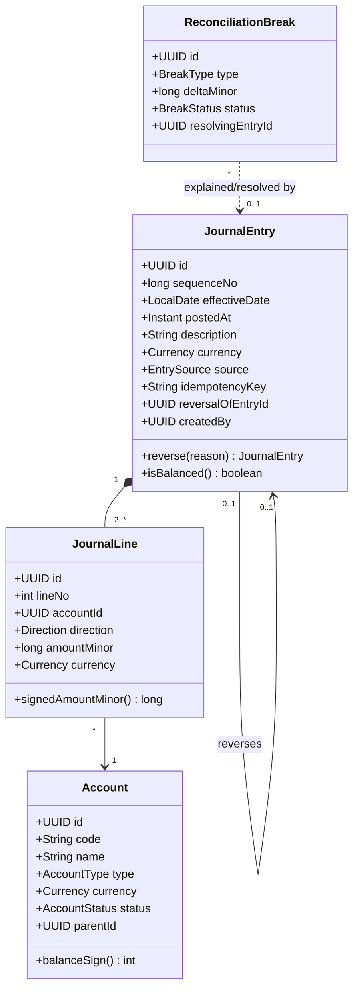

# 1. Domain Model

The ledger has one job: record what happened to money in a way that cannot be
quietly rewritten later. Everything else in this project — the API, the back
office, the reconciliation engine — is a view over that record.

## 1.1 Vocabulary

| Term | Meaning here |
|---|---|
| **Account** | A named bucket money is measured in. Belongs to exactly one account type and one currency. |
| **Journal entry** | One atomic financial fact ("we received 125.00 EUR from customer X"). Contains two or more lines. |
| **Journal line** | One side of the fact: an account, a direction (debit/credit) and an amount. Also called a *posting*. |
| **Transfer** | A convenience shape over a journal entry with exactly two lines. |
| **Reversal** | A new entry that mirrors an earlier one with directions flipped. The mechanism for corrections. |
| **Balance** | Not stored. Derived by summing the lines that touch an account. |
| **Trial balance** | The sum of every line in the system, grouped by account. Must net to zero. |

## 1.2 Account types and normal balance

Five types, following the accounting equation `Assets = Liabilities + Equity`
extended with the temporary accounts that roll into equity:

| Type | Normal balance | `balance_sign` | Increases on |
|---|---|---|---|
| `ASSET` | Debit | `+1` | Debit |
| `EXPENSE` | Debit | `+1` | Debit |
| `LIABILITY` | Credit | `-1` | Credit |
| `EQUITY` | Credit | `-1` | Credit |
| `REVENUE` | Credit | `-1` | Credit |

`balance_sign` is the bridge between the two ways of looking at an amount:

- **Signed amount** — debit is `+`, credit is `-`. Useful because *every* correct
  set of lines sums to zero, regardless of account type. This is what the
  database sums.
- **Natural balance** — the number a human expects to see. A liability with
  `-500` signed is reported as `500` outstanding.

```
natural_balance = signed_balance × balance_sign
```

Keeping both representations, with one derived from the other by a constant per
account type, avoids the classic bug where a report negates the wrong side.

## 1.3 The invariants

These are the statements the system promises are true at every instant. They are
enforced in **three** places — the domain model, the database, and the test suite
— because each layer catches a different class of mistake. See
[ADR-0008](adr/0008-invariants-enforced-in-database-and-tests.md).

| # | Invariant | Enforced by |
|---|---|---|
| **I1** | Every entry balances: `SUM(signed_amount_minor) = 0` over its lines. | Deferred constraint trigger + domain model + property test |
| **I2** | Every entry has at least two lines. | Deferred constraint trigger + domain model |
| **I3** | Every line amount is a non-zero positive integer in minor units; the direction carries the sign. | `CHECK (amount_minor > 0)` + type system (no floats anywhere) |
| **I4** | All lines of an entry share one currency. | Deferred constraint trigger; see [ADR-0005](adr/0005-single-currency-per-transaction.md) |
| **I5** | A line's currency equals its account's currency. | Composite foreign key `(account_id, currency)` |
| **I6** | Journal entries and lines are never updated or deleted. | `BEFORE UPDATE OR DELETE` trigger + `REVOKE` on the application role |
| **I7** | The whole journal nets to zero: `SUM(signed_amount_minor) = 0` over all lines. | Follows from I1; asserted directly as a system-level test and a health check |
| **I8** | An entry can be reversed at most once. | Partial unique index on `reversal_of_entry_id` |
| **I9** | A reversal's lines are the exact mirror of the reversed entry's lines. | Domain model (reversal is generated, never hand-built) + integration test |

I1 is the definition of double entry. I6 is what makes the ledger an audit
trail rather than a spreadsheet. The rest exist to stop those two from being
undermined by accident.

## 1.4 Append-only, and what corrections look like

There is no `UPDATE` path and no `DELETE` path for financial data. A mistake is
corrected the way accountants have corrected mistakes for centuries: by posting
a new entry that cancels the old one.

```
Entry #41  (wrong: 200.00 charged instead of 20.00)
  DR  Accounts Receivable        200.00
  CR  Revenue                             200.00

Entry #57  (reversal of #41, reversal_of_entry_id = 41)
  DR  Revenue                     200.00
  CR  Accounts Receivable                 200.00

Entry #58  (the correct posting)
  DR  Accounts Receivable         20.00
  CR  Revenue                              20.00
```

After #58 the net effect on receivables is `+20.00`, and all three facts remain
visible. The back office renders #41 with a strikethrough and a link to #57 — the
entry is *superseded*, not erased.

Consequences worth stating explicitly:

- The audit trail is not a side table that could drift from reality. The journal
  **is** the audit trail.
- History is stable: a balance computed as of last Tuesday returns the same
  number today and next year.
- Storage grows monotonically. For a demo deployment this is handled by a
  scheduled reseed, not by deletion — see
  [Deployment §8.10](08-deployment.md#810-demo-data-lifecycle).

## 1.5 Two dates, deliberately

Every entry carries two timestamps, and they answer different questions:

- `effective_date` (`DATE`) — **when it happened** in business terms. Drives
  balances, trial balance, period reporting, and reconciliation windows.
- `posted_at` (`TIMESTAMPTZ`) — **when we learned about it**. Immutable, set by
  the database. Drives the audit trail and "what did we believe on date X".

A payment that occurred on 30 June but was imported on 3 July has
`effective_date = 2026-06-30` and `posted_at = 2026-07-03T09:12:44Z`. That gap is
precisely the *timing difference* the reconciliation engine has to classify
rather than report as a mismatch — see [Reconciliation](05-reconciliation.md).

Backdating (`effective_date` in the past) is allowed and audited. Postdating is
rejected: an entry cannot be effective in the future.

## 1.6 Money

Money is a `BIGINT` count of **minor units** plus an ISO-4217 currency code. Never
a `double`, never a bare `BigDecimal` without a currency attached to it.
`BIGINT` holds ±92 trillion euro-cents, which is comfortable.

In Java this is a value object:

```java
public record Money(long amountMinor, Currency currency) {
    public Money {
        Objects.requireNonNull(currency);
    }
    public Money plus(Money other) {
        requireSameCurrency(other);
        return new Money(Math.addExact(amountMinor, other.amountMinor), currency);
    }
}
```

`Math.addExact` rather than `+`: an overflow should be a loud failure, not a
silently negative balance. Rationale and the API-level consequences are in
[ADR-0002](adr/0002-integer-minor-units-for-money.md).

Currencies with a minor unit exponent other than 2 (JPY has 0, TND has 3) are
handled by reading the exponent from `java.util.Currency` at the formatting
boundary. The stored integer is always in the smallest unit for that currency.

## 1.7 Aggregates and where the transaction boundary is

`JournalEntry` (with its lines) is the single write aggregate. It is created
whole, validated whole, and persisted whole in one database transaction. There
is no API that appends a line to an existing entry, because an entry with one
line has never been a valid state.

`Account` is a separate aggregate. It is mutable in the boring ways (name,
status) and immutable in the ways that matter: **type and currency cannot change
after the first line is posted**, since either change would retroactively
reinterpret existing history.

Reconciliation objects (`StatementImport`, `ReconciliationBreak`) form a third
aggregate that *references* the journal and never writes to it. When a break is
resolved by an adjusting entry, reconciliation calls the same posting service
every other caller uses. It gets no privileged path.

## 1.8 Model sketch



## 1.9 Worked example: the demo chart of accounts

The seeded demo models a small payments business, because it produces every
interesting case (receivables, a clearing account, fees, an FX-adjacent
liability) without needing accounting knowledge to read.

```
1000  Cash at Bank                 ASSET      EUR
1100  Payment Processor Clearing   ASSET      EUR
1200  Accounts Receivable          ASSET      EUR
2000  Accounts Payable             LIABILITY  EUR
2100  Customer Wallets Payable     LIABILITY  EUR
3000  Retained Earnings            EQUITY     EUR
4000  Revenue — Subscriptions      REVENUE    EUR
5000  Expense — Processor Fees     EXPENSE    EUR
```

A card payment of 100.00 EUR with a 2.90 EUR processor fee is *one* entry with
three lines — not two entries — because the fee and the settlement are the same
event and must never be able to exist independently:

```
DR  1100 Payment Processor Clearing    97.10
DR  5000 Expense — Processor Fees       2.90
CR  4000 Revenue — Subscriptions                100.00
                                       ------   ------
                                        100.00   100.00
```

This is the case that makes a two-line-only model wrong, which is why the core
API takes an n-line entry and `POST /transfers` is only a convenience wrapper
over it.

---

Next: [Data Model](02-data-model.md) — how these rules become a schema that
enforces them.
