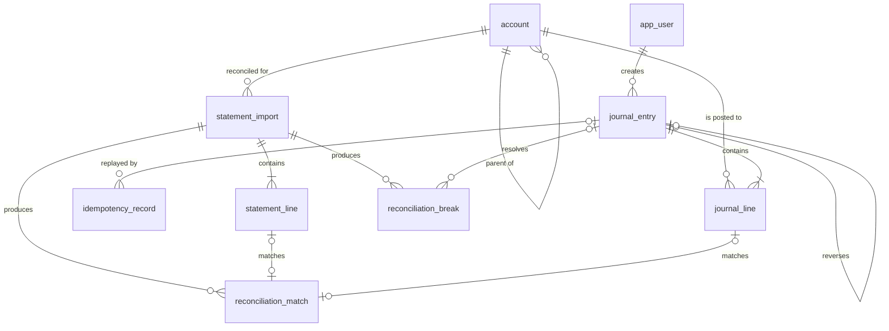

# 2. Data Model

The schema is written so that a bug in the application cannot produce an
unbalanced journal. Anything that would violate an invariant from
[§1.3](01-domain-model.md#13-the-invariants) fails at the database, not in a
service method that someone might forget to call.

All DDL lives in `backend/src/main/resources/db/migration` as Flyway migrations.
Migrations are forward-only; there are no `undo` scripts.

## 2.1 Enumerated types

```sql
CREATE TYPE account_type   AS ENUM ('ASSET', 'LIABILITY', 'EQUITY', 'REVENUE', 'EXPENSE');
CREATE TYPE account_status AS ENUM ('ACTIVE', 'ARCHIVED');
CREATE TYPE direction      AS ENUM ('DEBIT', 'CREDIT');
CREATE TYPE entry_source   AS ENUM ('API', 'TRANSFER', 'REVERSAL', 'IMPORT', 'ADJUSTMENT', 'SEED');
```

Native enums rather than lookup tables: these sets change at the speed of the
domain (approximately never), and having Postgres reject a typo is worth more
than the flexibility of a join.

## 2.2 `account`

```sql
CREATE TABLE account (
    id            UUID PRIMARY KEY DEFAULT gen_random_uuid(),
    code          TEXT           NOT NULL,
    name          TEXT           NOT NULL,
    type          account_type   NOT NULL,
    currency      CHAR(3)        NOT NULL,
    status        account_status NOT NULL DEFAULT 'ACTIVE',
    parent_id     UUID           REFERENCES account (id),
    balance_sign  SMALLINT       NOT NULL GENERATED ALWAYS AS (
                      CASE WHEN type IN ('ASSET', 'EXPENSE') THEN 1 ELSE -1 END
                  ) STORED,
    created_at    TIMESTAMPTZ    NOT NULL DEFAULT now(),
    created_by    UUID           NOT NULL REFERENCES app_user (id),
    version       BIGINT         NOT NULL DEFAULT 0,

    CONSTRAINT account_code_unique  UNIQUE (code),
    CONSTRAINT account_currency_iso CHECK (currency ~ '^[A-Z]{3}$'),
    CONSTRAINT account_not_own_parent CHECK (id <> parent_id),

    -- target for the composite FK from journal_line (invariant I5)
    CONSTRAINT account_id_currency_unique UNIQUE (id, currency)
);

CREATE INDEX account_parent_idx ON account (parent_id) WHERE parent_id IS NOT NULL;
```

Notes:

- `balance_sign` is **generated**, not supplied. The mapping from account type to
  sign is a property of accounting, so it is not something a caller gets to pass
  in and get wrong.
- `UNIQUE (id, currency)` looks redundant next to the primary key. It exists to
  give `journal_line` a composite foreign key target, which is what enforces
  invariant I5 declaratively — a line can only reference an account *at that
  account's own currency*.
- `version` supports optimistic locking on account metadata edits. The journal
  needs none: append-only writes never contend on a row.
- Changing `type` or `currency` after the first posting is blocked by a trigger
  (§2.7), because either would retroactively reinterpret existing history.

## 2.3 `journal_entry`

```sql
CREATE TABLE journal_entry (
    id                   UUID PRIMARY KEY DEFAULT gen_random_uuid(),
    sequence_no          BIGINT GENERATED ALWAYS AS IDENTITY,
    effective_date       DATE         NOT NULL,
    posted_at            TIMESTAMPTZ  NOT NULL DEFAULT clock_timestamp(),
    description          TEXT         NOT NULL,
    currency             CHAR(3)      NOT NULL,
    source               entry_source NOT NULL,
    external_ref         TEXT,
    idempotency_key      TEXT,
    reversal_of_entry_id UUID         REFERENCES journal_entry (id),
    reversal_reason      TEXT,
    created_by           UUID         NOT NULL REFERENCES app_user (id),
    request_id           TEXT         NOT NULL,

    CONSTRAINT entry_description_not_blank CHECK (length(btrim(description)) > 0),
    CONSTRAINT entry_currency_iso          CHECK (currency ~ '^[A-Z]{3}$'),
    CONSTRAINT entry_not_postdated         CHECK (effective_date <= (posted_at AT TIME ZONE 'UTC')::date),
    CONSTRAINT entry_not_self_reversal     CHECK (id <> reversal_of_entry_id),
    CONSTRAINT entry_reversal_has_reason   CHECK (
        (reversal_of_entry_id IS NULL) = (reversal_reason IS NULL)
    )
);

-- I8: an entry can be reversed at most once
CREATE UNIQUE INDEX entry_single_reversal_idx
    ON journal_entry (reversal_of_entry_id)
    WHERE reversal_of_entry_id IS NOT NULL;

-- second line of defence behind the idempotency store (see §4)
CREATE UNIQUE INDEX entry_idempotency_key_idx
    ON journal_entry (idempotency_key)
    WHERE idempotency_key IS NOT NULL;

CREATE INDEX entry_effective_date_idx ON journal_entry (effective_date, sequence_no);
CREATE INDEX entry_posted_at_idx      ON journal_entry (posted_at DESC);
CREATE INDEX entry_external_ref_idx   ON journal_entry (external_ref) WHERE external_ref IS NOT NULL;
```

`sequence_no` is a gapless-enough monotonic counter used for stable cursor
pagination and for "show me everything after entry N" in the audit view. It is
not a business identifier; the UUID is.

`request_id` is the correlation id propagated from the HTTP layer through logs
and traces. Given an entry in the back office, you can find the exact request
that produced it in the logs — that is the point of storing it on the row.

## 2.4 `journal_line`

```sql
CREATE TABLE journal_line (
    id                   UUID PRIMARY KEY DEFAULT gen_random_uuid(),
    entry_id             UUID      NOT NULL REFERENCES journal_entry (id),
    line_no              SMALLINT  NOT NULL,
    account_id           UUID      NOT NULL,
    direction            direction NOT NULL,
    amount_minor         BIGINT    NOT NULL,
    currency             CHAR(3)   NOT NULL,
    memo                 TEXT,

    -- denormalised from journal_entry; safe because both rows are immutable (I6)
    effective_date       DATE      NOT NULL,

    signed_amount_minor  BIGINT NOT NULL GENERATED ALWAYS AS (
        CASE WHEN direction = 'DEBIT' THEN amount_minor ELSE -amount_minor END
    ) STORED,

    CONSTRAINT line_amount_positive CHECK (amount_minor > 0),          -- I3
    CONSTRAINT line_unique_per_entry UNIQUE (entry_id, line_no),
    CONSTRAINT line_account_currency_fk                                 -- I5
        FOREIGN KEY (account_id, currency) REFERENCES account (id, currency)
);

CREATE INDEX line_entry_idx   ON journal_line (entry_id, line_no);
CREATE INDEX line_account_idx ON journal_line (account_id, effective_date, id)
                               INCLUDE (signed_amount_minor);
```

Three decisions carry weight here:

**`amount_minor > 0`, always.** The sign lives in `direction`. A negative debit
is not a thing an accountant would write, and allowing it would give every
amount two representations — which means two code paths, and eventually a
disagreement between them.

**`signed_amount_minor` is generated.** It cannot drift from `direction` and
`amount_minor` because Postgres computes it. Every balance query is then a plain
`SUM()` with no `CASE`, which also lets the covering index answer balance queries
without touching the heap.

**`effective_date` is denormalised onto the line.** Normally a copied column is a
liability, since it can go stale. Here it cannot: invariant I6 means neither row
ever changes after insert. In exchange, every balance-as-of query drops a join
against a table that will be the largest in the database.

## 2.5 Enforcing "every entry balances" (I1, I2, I4)

`CHECK` constraints see one row. The balancing rule spans the whole set of lines
for an entry, and the lines do not all exist until the insert is finished. The
tool for that is a **deferred constraint trigger**, which fires once at
`COMMIT`:

```sql
CREATE OR REPLACE FUNCTION assert_entry_is_balanced() RETURNS TRIGGER AS $$
DECLARE
    v_line_count   INT;
    v_signed_total BIGINT;
    v_currencies   INT;
BEGIN
    SELECT count(*), COALESCE(sum(signed_amount_minor), 0), count(DISTINCT currency)
      INTO v_line_count, v_signed_total, v_currencies
      FROM journal_line
     WHERE entry_id = NEW.entry_id;

    IF v_line_count < 2 THEN                                            -- I2
        RAISE EXCEPTION 'entry % has % line(s); at least 2 required',
            NEW.entry_id, v_line_count
            USING ERRCODE = 'check_violation';
    END IF;

    IF v_signed_total <> 0 THEN                                         -- I1
        RAISE EXCEPTION 'entry % is unbalanced by % minor units',
            NEW.entry_id, v_signed_total
            USING ERRCODE = 'check_violation';
    END IF;

    IF v_currencies > 1 THEN                                            -- I4
        RAISE EXCEPTION 'entry % mixes % currencies', NEW.entry_id, v_currencies
            USING ERRCODE = 'check_violation';
    END IF;

    RETURN NULL;
END;
$$ LANGUAGE plpgsql;

CREATE CONSTRAINT TRIGGER journal_line_balanced
    AFTER INSERT ON journal_line
    DEFERRABLE INITIALLY DEFERRED
    FOR EACH ROW EXECUTE FUNCTION assert_entry_is_balanced();
```

`DEFERRABLE INITIALLY DEFERRED` is the whole trick: lines are inserted one at a
time, the entry is transiently unbalanced during the insert, and the check runs
only when the transaction tries to commit. An unbalanced entry cannot reach
durable storage by any route — not via the API, not via a migration, not via
someone with a `psql` prompt.

The cost is that the failure surfaces at commit rather than at insert. The
application therefore also validates balance in the domain model before it even
opens a transaction, so callers get a clean `422` with a field-level message
instead of a transaction-level error. The trigger is the backstop, not the
primary user experience.

## 2.6 Enforcing append-only (I6)

```sql
CREATE OR REPLACE FUNCTION reject_mutation() RETURNS TRIGGER AS $$
BEGIN
    RAISE EXCEPTION '% on % is forbidden: the journal is append-only. '
                    'Post a reversing entry instead.', TG_OP, TG_TABLE_NAME
        USING ERRCODE = 'restrict_violation',
              HINT = 'POST /api/v1/journal-entries/{id}/reversal';
END;
$$ LANGUAGE plpgsql;

CREATE TRIGGER journal_entry_immutable
    BEFORE UPDATE OR DELETE ON journal_entry
    FOR EACH ROW EXECUTE FUNCTION reject_mutation();

CREATE TRIGGER journal_line_immutable
    BEFORE UPDATE OR DELETE ON journal_line
    FOR EACH ROW EXECUTE FUNCTION reject_mutation();
```

And, independently, at the privilege level:

```sql
REVOKE UPDATE, DELETE, TRUNCATE ON journal_entry, journal_line FROM ledger_app;
GRANT  SELECT, INSERT                ON journal_entry, journal_line TO   ledger_app;
```

Two mechanisms for one rule is deliberate. The grant is the real boundary — the
application's role is structurally incapable of issuing the statement. The
trigger is what produces a readable error message, and what still protects the
data if a future migration hands out a broader grant by mistake. The Flyway
migration role (`ledger_migrator`) is separate and does hold DDL rights; that
separation is what keeps "the app can deploy schema changes" from collapsing
into "the app can delete history".

## 2.7 Protecting account reinterpretation

```sql
CREATE OR REPLACE FUNCTION reject_account_reinterpretation() RETURNS TRIGGER AS $$
BEGIN
    IF (NEW.type <> OLD.type OR NEW.currency <> OLD.currency)
       AND EXISTS (SELECT 1 FROM journal_line WHERE account_id = OLD.id) THEN
        RAISE EXCEPTION 'account % has postings; type and currency are frozen', OLD.code
            USING ERRCODE = 'restrict_violation';
    END IF;
    RETURN NEW;
END;
$$ LANGUAGE plpgsql;

CREATE TRIGGER account_type_currency_frozen
    BEFORE UPDATE ON account
    FOR EACH ROW EXECUTE FUNCTION reject_account_reinterpretation();
```

Renaming an account is fine — the name is a label. Changing its type silently
rewrites the meaning of every historical line that touched it, so it is not.

## 2.8 Deriving balances

No balance is stored. This is the point of the design: there is exactly one
source of truth, and reads are projections of it.

**Balance of one account as of a date:**

```sql
SELECT a.id,
       a.code,
       a.currency,
       COALESCE(SUM(l.signed_amount_minor), 0)                  AS signed_balance_minor,
       COALESCE(SUM(l.signed_amount_minor), 0) * a.balance_sign AS natural_balance_minor
  FROM account a
  LEFT JOIN journal_line l
         ON l.account_id = a.id
        AND l.effective_date <= :as_of
 WHERE a.id = :account_id
 GROUP BY a.id, a.code, a.currency, a.balance_sign;
```

The date predicate sits in the `ON` clause, not in `WHERE` — otherwise an
account with no postings before `:as_of` would vanish from the result instead of
reporting zero. This is a small thing that is wrong in a surprising amount of
production reporting code, so it has a dedicated regression test.

**Trial balance as of a date:**

```sql
SELECT a.type,
       a.code,
       a.name,
       SUM(l.signed_amount_minor) FILTER (WHERE l.direction = 'DEBIT')  AS total_debit_minor,
       SUM(-l.signed_amount_minor) FILTER (WHERE l.direction = 'CREDIT') AS total_credit_minor,
       SUM(l.signed_amount_minor)                                        AS signed_balance_minor
  FROM journal_line l
  JOIN account a ON a.id = l.account_id
 WHERE l.effective_date <= :as_of
 GROUP BY a.type, a.code, a.name
 ORDER BY a.code;
```

Invariant I7 says `SUM(signed_balance_minor)` across all rows of that result is
`0`. The API returns that figure as an explicit `outOfBalanceMinor` field rather
than asserting it silently — a report that quietly assumes it is balanced is
useless for detecting the one case you care about. The same query, unfiltered,
backs the `/actuator/health/ledgerBalance` health indicator.

**Movements (statement view) for an account:**

```sql
SELECT e.sequence_no, e.id AS entry_id, e.effective_date, e.posted_at,
       e.description, e.source, e.reversal_of_entry_id,
       l.direction, l.amount_minor, l.signed_amount_minor, l.memo,
       SUM(l.signed_amount_minor) OVER (
           ORDER BY e.effective_date, e.sequence_no, l.line_no
           ROWS BETWEEN UNBOUNDED PRECEDING AND CURRENT ROW
       ) * a.balance_sign AS running_balance_minor
  FROM journal_line l
  JOIN journal_entry e ON e.id = l.entry_id
  JOIN account a       ON a.id = l.account_id
 WHERE l.account_id = :account_id
   AND l.effective_date BETWEEN :from AND :to
 ORDER BY e.effective_date, e.sequence_no, l.line_no;
```

The running balance is a window function rather than an application-side
accumulator, so pagination cannot corrupt it.

### On performance

Derived balances mean an account's balance costs `O(lines on that account)`. For
the demo volume (tens of thousands of lines) the covering index on
`journal_line (account_id, effective_date, id) INCLUDE (signed_amount_minor)`
makes this an index-only scan in single-digit milliseconds.

It does not scale forever, and the design anticipates that: the roadmap's
balance snapshots (`docs/09-roadmap.md`) add a periodic checkpoint per account
so a balance becomes *nearest snapshot + lines since*. Critically, snapshots are
a **cache that can be dropped and rebuilt**, never a source of truth. Building
the derived version first is what makes that safe to add later.

## 2.9 Idempotency store

```sql
CREATE TYPE idempotency_status AS ENUM ('IN_PROGRESS', 'COMPLETED');

CREATE TABLE idempotency_record (
    key                  TEXT               NOT NULL,
    endpoint             TEXT               NOT NULL,
    principal_id         UUID               NOT NULL REFERENCES app_user (id),
    request_fingerprint  BYTEA              NOT NULL,
    status               idempotency_status NOT NULL DEFAULT 'IN_PROGRESS',
    response_status      SMALLINT,
    response_body        JSONB,
    entry_id             UUID               REFERENCES journal_entry (id),
    created_at           TIMESTAMPTZ        NOT NULL DEFAULT now(),
    completed_at         TIMESTAMPTZ,
    expires_at           TIMESTAMPTZ        NOT NULL,

    PRIMARY KEY (key, endpoint, principal_id),
    CONSTRAINT idem_completed_has_response CHECK (
        status <> 'COMPLETED' OR (response_status IS NOT NULL AND response_body IS NOT NULL)
    )
);

CREATE INDEX idem_expires_idx ON idempotency_record (expires_at);
```

The key is scoped by endpoint and principal so that two clients choosing the
same UUID cannot collide, and so a key used for a transfer cannot accidentally
short-circuit a different operation. Semantics are in
[Idempotency](04-idempotency.md).

## 2.10 Reconciliation tables

```sql
CREATE TYPE import_status AS ENUM ('PENDING', 'MATCHING', 'COMPLETED', 'FAILED');
CREATE TYPE break_type    AS ENUM (
    'MISSING_IN_LEDGER', 'MISSING_IN_STATEMENT', 'AMOUNT_MISMATCH',
    'TIMING_DIFFERENCE', 'DUPLICATE_IN_LEDGER', 'DUPLICATE_IN_STATEMENT',
    'CURRENCY_MISMATCH'
);
CREATE TYPE break_status  AS ENUM ('OPEN', 'EXPLAINED', 'RESOLVED', 'WRITTEN_OFF');

CREATE TABLE statement_import (
    id                    UUID PRIMARY KEY DEFAULT gen_random_uuid(),
    account_id            UUID          NOT NULL REFERENCES account (id),
    currency              CHAR(3)       NOT NULL,
    period_start          DATE          NOT NULL,
    period_end            DATE          NOT NULL,
    opening_balance_minor BIGINT        NOT NULL,
    closing_balance_minor BIGINT        NOT NULL,
    source_filename       TEXT          NOT NULL,
    content_sha256        BYTEA         NOT NULL,
    status                import_status NOT NULL DEFAULT 'PENDING',
    imported_at           TIMESTAMPTZ   NOT NULL DEFAULT now(),
    imported_by           UUID          NOT NULL REFERENCES app_user (id),

    CONSTRAINT import_period_ordered CHECK (period_start <= period_end),
    CONSTRAINT import_not_duplicate  UNIQUE (account_id, content_sha256)
);

CREATE TABLE statement_line (
    id               UUID PRIMARY KEY DEFAULT gen_random_uuid(),
    import_id        UUID    NOT NULL REFERENCES statement_import (id) ON DELETE CASCADE,
    row_no           INT     NOT NULL,
    value_date       DATE    NOT NULL,
    amount_minor     BIGINT  NOT NULL,          -- signed: bank's perspective
    currency         CHAR(3) NOT NULL,
    description      TEXT    NOT NULL,
    external_id      TEXT,
    counterparty_ref TEXT,

    CONSTRAINT stmt_line_nonzero CHECK (amount_minor <> 0),
    CONSTRAINT stmt_line_unique  UNIQUE (import_id, row_no)
);

CREATE TABLE reconciliation_match (
    id               UUID PRIMARY KEY DEFAULT gen_random_uuid(),
    import_id        UUID   NOT NULL REFERENCES statement_import (id) ON DELETE CASCADE,
    statement_line_id UUID  NOT NULL REFERENCES statement_line (id) ON DELETE CASCADE,
    journal_line_id  UUID   NOT NULL REFERENCES journal_line (id),
    rule             TEXT   NOT NULL,
    confidence       NUMERIC(4,3) NOT NULL CHECK (confidence BETWEEN 0 AND 1),
    matched_at       TIMESTAMPTZ NOT NULL DEFAULT now(),

    CONSTRAINT match_line_once      UNIQUE (import_id, statement_line_id),
    CONSTRAINT match_journal_once   UNIQUE (import_id, journal_line_id)
);

CREATE TABLE reconciliation_break (
    id                UUID         PRIMARY KEY DEFAULT gen_random_uuid(),
    import_id         UUID         NOT NULL REFERENCES statement_import (id) ON DELETE CASCADE,
    type              break_type   NOT NULL,
    status            break_status NOT NULL DEFAULT 'OPEN',
    statement_line_id UUID         REFERENCES statement_line (id) ON DELETE CASCADE,
    journal_line_id   UUID         REFERENCES journal_line (id),
    delta_minor       BIGINT       NOT NULL,
    currency          CHAR(3)      NOT NULL,
    detail            JSONB        NOT NULL DEFAULT '{}'::jsonb,
    explanation       TEXT,
    resolving_entry_id UUID        REFERENCES journal_entry (id),
    resolved_by       UUID         REFERENCES app_user (id),
    resolved_at       TIMESTAMPTZ,

    CONSTRAINT break_has_a_side CHECK (
        statement_line_id IS NOT NULL OR journal_line_id IS NOT NULL
    ),
    CONSTRAINT break_resolution_complete CHECK (
        status <> 'RESOLVED' OR (resolving_entry_id IS NOT NULL AND resolved_by IS NOT NULL)
    ),
    CONSTRAINT break_explained_has_text CHECK (
        status NOT IN ('EXPLAINED', 'WRITTEN_OFF') OR explanation IS NOT NULL
    )
);

CREATE INDEX break_import_status_idx ON reconciliation_break (import_id, status, type);
```

`delta_minor` on every break is what makes the report a *bridge* rather than a
list: the deltas of all open breaks must sum exactly to the difference between
the ledger balance and the statement balance. See
[Reconciliation §5.4](05-reconciliation.md#54-the-bridge-invariant).

Note that `reconciliation_break` **is** mutable — it has a status lifecycle. That
is intentional and consistent: it holds opinions about the world, not financial
facts. Resolving a break never edits the journal; it posts a new entry and
records its id here.

## 2.11 Users, roles, audit

```sql
CREATE TYPE app_role AS ENUM ('OPERATOR', 'AUDITOR', 'ADMIN');

CREATE TABLE app_user (
    id            UUID PRIMARY KEY DEFAULT gen_random_uuid(),
    email         CITEXT      NOT NULL UNIQUE,
    display_name  TEXT        NOT NULL,
    password_hash TEXT        NOT NULL,          -- bcrypt, cost 12
    role          app_role    NOT NULL,
    enabled       BOOLEAN     NOT NULL DEFAULT TRUE,
    created_at    TIMESTAMPTZ NOT NULL DEFAULT now()
);

CREATE TABLE audit_event (
    id           BIGINT GENERATED ALWAYS AS IDENTITY PRIMARY KEY,
    occurred_at  TIMESTAMPTZ NOT NULL DEFAULT clock_timestamp(),
    actor_id     UUID        REFERENCES app_user (id),
    actor_role   app_role,
    action       TEXT        NOT NULL,
    target_type  TEXT        NOT NULL,
    target_id    TEXT,
    request_id   TEXT        NOT NULL,
    ip_address   INET,
    outcome      TEXT        NOT NULL CHECK (outcome IN ('SUCCESS', 'DENIED', 'FAILED')),
    detail       JSONB       NOT NULL DEFAULT '{}'::jsonb
);

CREATE INDEX audit_target_idx     ON audit_event (target_type, target_id, occurred_at DESC);
CREATE INDEX audit_actor_time_idx ON audit_event (actor_id, occurred_at DESC);

CREATE TRIGGER audit_event_immutable
    BEFORE UPDATE OR DELETE ON audit_event
    FOR EACH ROW EXECUTE FUNCTION reject_mutation();
```

`audit_event` covers what the journal cannot: logins, denied authorisation
attempts, account creation, break explanations, statement imports. Financial
history stays in the journal; this table records *who did what to the system*.
It is append-only for the same reason.

Boot-time seeding creates the three demo users described in
[API §3.2](03-api.md#32-authentication-and-roles). Their passwords come from
environment variables, never from a migration file.

## 2.12 Entity relationships



## 2.13 Migration order

| Version | Contents |
|---|---|
| `V1__enums_and_users.sql` | Enum types, `app_user`, `audit_event`, `reject_mutation()` |
| `V2__accounts.sql` | `account` + generated `balance_sign` + freeze trigger |
| `V3__journal.sql` | `journal_entry`, `journal_line`, balance + immutability triggers |
| `V4__idempotency.sql` | `idempotency_record` |
| `V5__reconciliation.sql` | Statement import, lines, matches, breaks |
| `V6__grants.sql` | `ledger_app` role, `REVOKE`/`GRANT` matrix |
| `R__demo_seed.sql` | Repeatable; chart of accounts + demo data, guarded by a profile flag |

`R__demo_seed.sql` is repeatable and idempotent (`ON CONFLICT DO NOTHING` on
account codes) so a redeploy of the demo environment never duplicates the chart
of accounts.

---

Next: [API Design](03-api.md).
