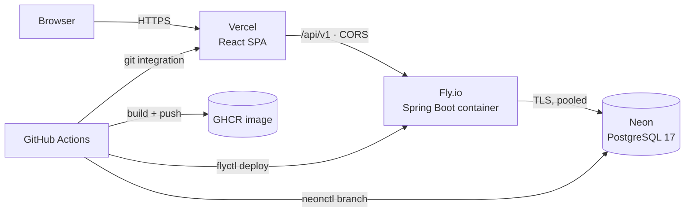

# 8. Deployment & CI/CD

Target: a permanently live demo that costs approximately nothing, deploys from
`main` without manual steps, and can be redeployed from a clean checkout.

## 8.1 Topology



| Component | Host | Why |
|---|---|---|
| Frontend | Vercel | Static SPA, global CDN, preview URL per PR, free tier that does not expire |
| Backend | Fly.io | Runs the Docker image directly, scale-to-zero, EU region next to the DB |
| Database | Neon | Serverless Postgres with a non-expiring free tier and **database branching** |
| Images | GHCR | Free for public repos, same credentials as the repo |

The pairing is chosen for one property the others lack: Neon's branching gives
each pull request its own real database, seeded from the demo branch, created in
seconds and dropped when the PR closes. That is what makes preview environments
honest — a preview that shares the production database is not a preview.
Rationale and the alternatives considered: [ADR-0006](adr/0006-hosting-topology.md).

**Cost:** €0/month at demo scale. Fly's scale-to-zero means the machine is
suspended when idle; the trade-off is a cold start, addressed in §8.6.

## 8.2 Monorepo layout

Frontend and backend live in one repository. They share the API contract, and a
change that touches both should be one commit and one review — which is exactly
what a split repo makes impossible.

```
DoubleEntryLedger/
├── backend/                  Spring Boot (Maven)
│   ├── src/main/java/dev/lseg/ledger/
│   │   ├── domain/           entities, value objects, invariants — no Spring
│   │   ├── ledger/           posting service, balance & movement queries
│   │   ├── idempotency/
│   │   ├── reconciliation/
│   │   ├── api/              controllers, DTOs, problem+json mapping
│   │   ├── security/         JWT, RBAC, audit
│   │   └── config/
│   ├── src/main/resources/db/migration/    Flyway
│   ├── src/test/java/…
│   └── Dockerfile
├── frontend/                 React + TypeScript (Vite)
├── docs/                     this documentation
│   ├── adr/
│   └── openapi/v1.yaml       committed contract, diffed in CI
├── infra/
│   ├── fly.toml
│   ├── compose.yaml          local dev + E2E stack
│   └── seed/                 demo chart of accounts and sample statements
└── .github/workflows/
```

Workflows are **path-filtered**, so a frontend-only change does not rebuild and
redeploy the backend and vice versa:

```yaml
on:
  push:
    branches: [main]
    paths: ['backend/**', '.github/workflows/backend-*.yml', 'infra/fly.toml']
```

The E2E job is the exception: it triggers on either side, since its whole
purpose is catching the case where the two drift apart.

## 8.3 Continuous integration

`.github/workflows/ci-backend.yml` — on PR and on `main`:

1. `actions/setup-java` (Temurin 21) with Maven cache
2. `mvn -B verify` — compile, Spotless check, Checkstyle, unit + property +
   integration tests (Testcontainers pulls Postgres 17; the runner's Docker
   daemon is already available)
3. JaCoCo thresholds enforced by the build, not by a reporting step
4. ArchUnit rules (part of `verify`)
5. Generate the OpenAPI document and `oasdiff breaking docs/openapi/v1.yaml <generated>`
6. Publish the JUnit report as a check annotation

`.github/workflows/ci-frontend.yml`:

1. `pnpm install --frozen-lockfile`
2. `tsc --noEmit`, `oxlint`, `vitest run --coverage`
3. `pnpm build` — a build failure is a CI failure, not a Vercel surprise

`.github/workflows/e2e.yml`:

1. `docker compose -f infra/compose.yaml up -d --wait` (Postgres + backend + frontend)
2. `pnpm playwright test`
3. Upload traces and screenshots on failure

`.github/workflows/security.yml` — Trivy on the built image, `dependency-review`
on PRs, CodeQL for Java and TypeScript weekly.

Concurrency is capped per branch so a rapid push sequence cancels superseded
runs:

```yaml
concurrency:
  group: ${{ github.workflow }}-${{ github.ref }}
  cancel-in-progress: true
```

## 8.4 The image

```dockerfile
# ---- build ----
FROM maven:3.9-eclipse-temurin-21 AS build
WORKDIR /build
COPY pom.xml .
RUN mvn -B dependency:go-offline           # cached unless pom.xml changes
COPY src ./src
RUN mvn -B clean package -DskipTests
RUN java -Djarmode=tools -jar target/*.jar extract --layers --destination /extracted \
    && mv /extracted/application/*.jar /extracted/application/app.jar

# ---- run ----
FROM eclipse-temurin:21-jre-alpine
RUN addgroup -S app && adduser -S app -G app
WORKDIR /app
COPY --from=build --chown=app:app /extracted/dependencies/ ./
COPY --from=build --chown=app:app /extracted/application/  ./
USER app
EXPOSE 8080
ENV JAVA_TOOL_OPTIONS="-XX:MaxRAMPercentage=75 -XX:+UseSerialGC -XX:TieredStopAtLevel=1"
ENTRYPOINT ["java", "-jar", "app.jar"]
```

Choices that matter:

- **Layered extraction.** Dependencies change rarely, application code changes
  every push. Splitting them means a typical deploy pushes a few hundred KB
  instead of ~60 MB, which is most of the deploy time on a small machine.
- **A thin jar, not `JarLauncher`.** Spring Boot 3.3 replaced `layertools` with
  `jarmode=tools`, and the layout it produces is different: `application/app.jar`
  carries `Main-Class` and a `Class-Path: lib/…` manifest pointing at
  `dependencies/lib`, and the `spring-boot-loader` layer is empty. The entrypoint
  is therefore an ordinary `java -jar`, and app.jar and `lib/` must stay siblings.
- **`dependency:go-offline` before `COPY src`.** The dependency layer is cached
  unless `pom.xml` itself changes.
- **Non-root user.** Free, and the absence of it is the first thing a security
  review flags.
- **`UseSerialGC` + `TieredStopAtLevel=1`.** On a 256 MB single-CPU Fly machine
  these cut startup time and memory materially, and the throughput they cost is
  irrelevant at demo traffic. They are set here and *not* in the Compose file,
  so local development runs a normal JVM.
- **Tests skipped in the image build.** They already ran in CI against a real
  Postgres; running them again inside Docker would double the pipeline for no
  additional signal.

## 8.5 Migrations on deploy

```toml
# infra/fly.toml
app = "double-entry-ledger"
primary_region = "fra"

[build]
  image = "ghcr.io/lorenzosegalini/double-entry-ledger:${GITHUB_SHA}"

[deploy]
  release_command = "java -cp /app org.flywaydb.core.Flyway migrate"
  strategy = "rolling"

[env]
  SPRING_PROFILES_ACTIVE = "prod"
  SERVER_PORT = "8080"

[http_service]
  internal_port = 8080
  force_https = true
  auto_stop_machines = "suspend"
  auto_start_machines = true
  min_machines_running = 0

  [[http_service.checks]]
    path = "/actuator/health/readiness"
    interval = "15s"
    timeout = "3s"
    grace_period = "20s"

[[vm]]
  size = "shared-cpu-1x"
  memory = "512mb"
```

Migrations run as Fly's `release_command`: a one-off machine executes Flyway
**before** any new application instance receives traffic. If a migration fails
the deploy aborts and the previous version keeps serving. Running migrations
from application startup instead would mean N instances racing to migrate, and a
failure would leave a half-migrated schema serving requests.

`release_command` connects as `ledger_migrator` (DDL rights); the application
connects as `ledger_app` (no `UPDATE`/`DELETE` on journal tables, per
[§2.6](02-data-model.md#26-enforcing-append-only-i6)). Two roles, two secrets.
This separation is only meaningful if it survives deployment, which is why it is
wired here rather than described as an aspiration.

Migrations must be **backward compatible for one version**, because rolling
deploys briefly run old and new code against the new schema. Column drops and
renames are therefore two-step: stop writing in release *n*, drop in *n+1*.

## 8.6 Deploy workflow

```yaml
name: deploy-backend
on:
  push:
    branches: [main]
    paths: ['backend/**', 'infra/fly.toml', '.github/workflows/deploy-backend.yml']

jobs:
  deploy:
    runs-on: ubuntu-latest
    environment: production            # required reviewers + secret scoping
    permissions:
      contents: read
      packages: write
      id-token: write
    steps:
      - uses: actions/checkout@v4
      - uses: docker/setup-buildx-action@v3
      - uses: docker/login-action@v3
        with: { registry: ghcr.io, username: ${{ github.actor }}, password: ${{ secrets.GITHUB_TOKEN }} }
      - uses: docker/build-push-action@v6
        with:
          context: ./backend
          push: true
          tags: ghcr.io/${{ github.repository }}:${{ github.sha }},ghcr.io/${{ github.repository }}:latest
          cache-from: type=gha
          cache-to: type=gha,mode=max
      - uses: superfly/flyctl-actions/setup-flyctl@master
      - run: flyctl deploy --config infra/fly.toml --image ghcr.io/${{ github.repository }}:${{ github.sha }}
        env: { FLY_API_TOKEN: ${{ secrets.FLY_API_TOKEN }} }
      - name: Smoke test
        run: |
          curl --fail --retry 10 --retry-all-errors --retry-delay 5 \
               https://double-entry-ledger.fly.dev/actuator/health/ledgerBalance
```

The smoke test is not a ping. `/actuator/health/ledgerBalance` sums every signed
amount in the journal and reports `UP` only if the total is zero — so the deploy
gate is the system's core invariant, verified against production data, on every
release. If a migration or a code change ever broke double entry, the deploy
fails there.

Images are tagged by commit SHA, so rollback is `flyctl deploy --image
ghcr.io/…:<previous-sha>` with no rebuild.

**Cold starts.** With `min_machines_running = 0` the first request after an idle
period waits for the machine to resume (~1–2 s with the tuned JVM flags, since
suspend restores memory rather than booting cold). A GitHub Actions cron pings
the health endpoint every 10 minutes during European daytime, which keeps the
demo warm for a visitor arriving from a CV link and still lets it sleep
overnight.

## 8.7 Preview environments

On `pull_request`:

1. `neonctl branches create --name pr-${{ github.event.number }}` — a copy-on-write
   branch of the demo database, ready in seconds
2. `flyctl deploy --app ledger-pr-<n>` with that branch's connection string
3. Vercel's Git integration builds the frontend preview automatically; the API
   base URL is injected per-environment
4. A bot comments both URLs on the PR

On `pull_request: closed`, the Fly app and the Neon branch are destroyed. The
cleanup job runs with `if: always()` so a failed pipeline does not leak
resources — otherwise the free tier fills with orphans within a month.

## 8.8 Configuration and secrets

Nothing is configured in a file that is committed. `application.yml` holds only
defaults safe to be public; everything else comes from the environment.

| Variable | Where it lives |
|---|---|
| `DATABASE_URL` (app role) | `fly secrets` |
| `DATABASE_MIGRATION_URL` (migrator role) | `fly secrets` |
| `JWT_PRIVATE_KEY` (RSA PEM) | `fly secrets` |
| `DEMO_OPERATOR_PASSWORD` etc. | `fly secrets` |
| `FLY_API_TOKEN`, `NEON_API_KEY` | GitHub Environment `production` |
| `VITE_API_BASE_URL` | Vercel project env, per environment |

Demo passwords are published in the README — the demo is meant to be logged
into. They are still injected as secrets rather than baked into a migration, so
that the mechanism is the real one and a private deployment changes one variable
instead of one migration file.

Local development uses `infra/compose.yaml` with an `.env.example` committed and
`.env` git-ignored.

## 8.9 Observability

- **Health** — `/actuator/health` with liveness and readiness groups; Fly checks
  readiness. The custom `ledgerBalance` indicator described above.
- **Metrics** — Micrometer to `/actuator/prometheus`: JVM basics plus domain
  counters that are actually worth alerting on — `ledger.entries.posted`,
  `ledger.entries.rejected{reason}`, `ledger.idempotency.replays`,
  `ledger.reconciliation.breaks{type}`, `ledger.balance.out_of_balance_minor`.
- **Tracing** — Micrometer Tracing with W3C `traceparent` propagation; the
  frontend sends the header so a browser action can be followed to the SQL.
- **Logs** — structured JSON to stdout (Fly aggregates), every line carrying
  `requestId`, `traceId`, `userId` and `role`. `requestId` is the same value
  stored on `journal_entry.request_id`, which closes the loop between a row in
  the back office and the request that created it.

Money amounts are never logged at `INFO`. Account codes and entry ids are;
amounts and counterparty references are not, because logs have a different
retention and access model than the database.

## 8.10 Demo data lifecycle

The journal is append-only, so a public demo where anyone can post grows without
bound and drifts from the curated state that makes the reconciliation screens
worth looking at.

A scheduled GitHub Actions job runs nightly at 03:00 UTC:

1. `neonctl branches reset demo --parent main` — restores the demo branch to the
   curated snapshot
2. Re-runs `R__demo_seed.sql`
3. Verifies the seeded reconciliation report still produces exactly four breaks
   of the expected types — if the seed drifts, the job fails and opens an issue

This resets the *demo environment* by restoring a database branch. It is not a
deletion path in the application, and no code exists that can delete a journal
entry. The distinction is the entire point of
[ADR-0001](adr/0001-append-only-journal.md).

---

Next: [Roadmap](09-roadmap.md).
